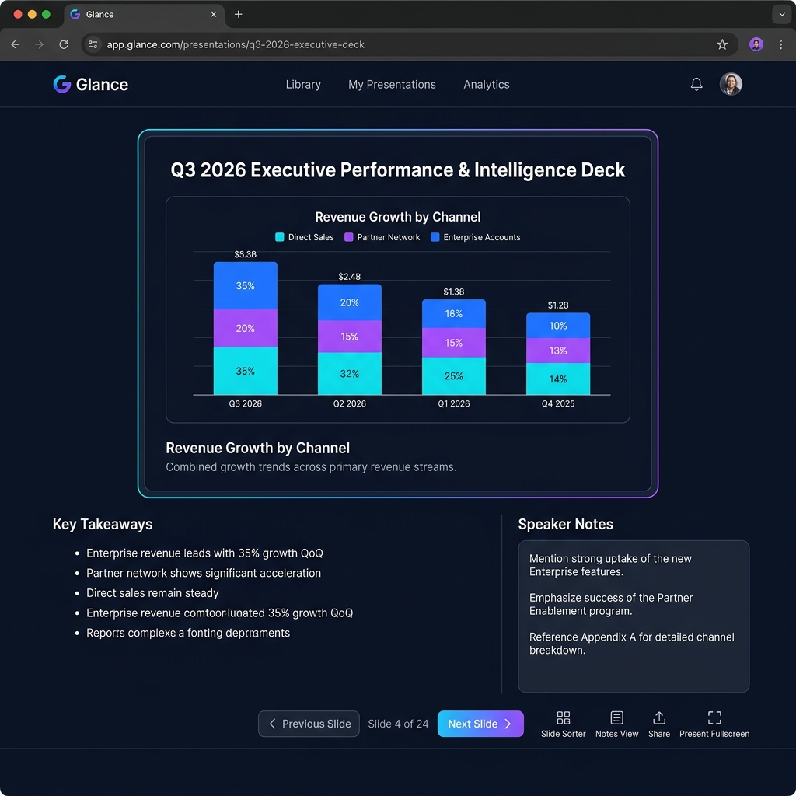
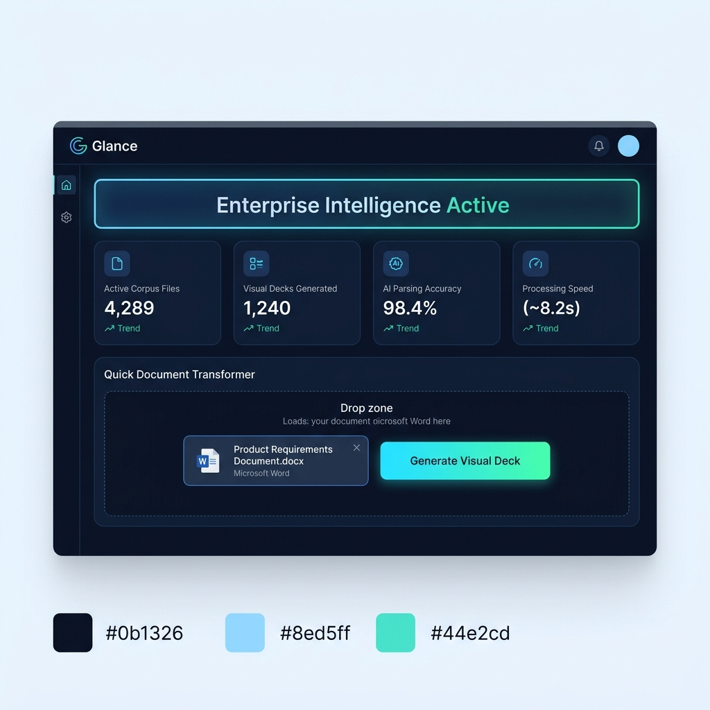
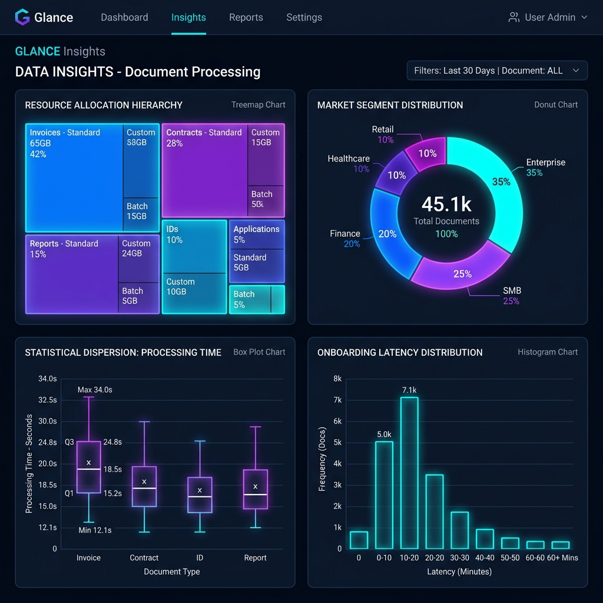

# ⚡ Glance — Interactive Document Deck & AI Data Intelligence Viewer

<p align="center">
  
</p>

<p align="center">
  <strong>Transform raw Word documents, strategy papers, and reports into interactive visual data decks powered by Gemini AI.</strong>
</p>

<p align="center">
  <a href="https://glance-umber-gamma.vercel.app/" target="_blank"><strong>🚀 Live Application Demo</strong></a> • 
  <a href="https://github.com/M-Ahsan-Takmeel/Glance" target="_blank"><strong>💻 GitHub Repository</strong></a>
</p>

<p align="center">
  <a href="#-a-project-overview-app-name--problem-statement">a. Overview & Problem</a> •
  <a href="#-b-live-deployed-url">b. Live Deployment</a> •
  <a href="#-c-full-features-list">c. Features List</a> •
  <a href="#-d-ai-feature--system-prompt">d. AI Feature & Prompt</a> •
  <a href="#%EF%B8%8F-e-tools-services--ai-models">e. Tech Stack</a> •
  <a href="#-f-screenshots-of-the-app-in-action-3-images">f. Screenshots</a> •
  <a href="#-g-how-to-run-the-project">g. Quick Start</a>
</p>

---

## 📌 [a] Project Overview, App Name & Problem Statement

### **App Name**: Glance

### **What It Does**
**Glance** is an interactive document intelligence platform that converts raw Word documents (`.docx`), strategic proposals, quarterly reviews, and corporate reports into high-impact, presentable visual slide decks powered by Gemini AI and client-side document processing.

### **The Real Problem It Solves**
- **Hours Wasted on Manual Slide Creation**: Executives, product managers, management consultants, and researchers spend 3 to 5 hours per presentation manually reading 30+ page Word documents, summarizing key points, and formatting charts in PowerPoint or Google Slides.
- **Cognitive Overload & Low Engagement**: Stakeholders struggle to digest long, dense text files. Critical financial metrics, statistical trends, and strategic takeaways get lost in paragraphs of text.
- **Design & Data Visualization Bottlenecks**: Non-designer teams struggle to format raw data cleanly into structured visual charts (treemaps, stacked bars, histograms, box plots).

### **For Whom (Target Audience)**
- **Executive Leadership & Founders**: Transform quarterly reports into interactive executive briefings in seconds.
- **Product & Strategy Operations**: Turn Product Requirements Documents (PRDs) and market research papers into presentable decks.
- **Researchers & Analysts**: Summarize academic papers, whitepapers, and operational data into clear statistical dispersion cards.
- **Enterprise Consultants**: Pitch strategic roadmaps directly from uploaded documents without manual formatting.

---

## 🌐 [b] Live Deployed URL

- 🟢 **Live Deployed Application**: [https://glance-umber-gamma.vercel.app/](https://glance-umber-gamma.vercel.app/)
- 🐙 **GitHub Repository**: [https://github.com/M-Ahsan-Takmeel/Glance](https://github.com/M-Ahsan-Takmeel/Glance)

---

## ✨ [c] Full Features List

- 📑 **In-Browser `.docx` Document Parsing**: Client-side document parsing via `mammoth.js` extracts structured text, section headings, word counts, and character statistics securely in the browser.
- 🤖 **Gemini AI Semantic Restructuring**: Translates unstructured document text into 13 distinct visual card types using `@google/genai` (`gemini-3.6-flash`).
- 📊 **Rich Interactive Data Charts**:
  - **Stacked Bar Charts**: Multi-tier metric distributions across quarters, regions, or channels.
  - **Treemaps**: Visual weight and budget allocation hierarchies across departments.
  - **Pie & Donut Charts**: Percentage distribution across market segments and customer tiers.
  - **Histograms**: Frequency distributions across operational latency bins and turnaround times.
  - **Box Plot Statistical Summaries**: 5-number statistical dispersion cards (Min, Q1, Median, Q3, Max).
  - **Trend Graphs**: Multi-month trajectory lines vs target performance thresholds.
  - **Structured Section Headings**: Section summaries with bullet points and big metric callouts.
  - **Timelines, Quotes, & Grids**: Sequential roadmaps, executive quotes, and strategy comparison grids.
- 🎨 **Tailored Style Intents**: Customize generation matching intent: *Executive Summary*, *Data Intelligence*, *Strategic Roadmap*, *Pitch Deck*, or *Technical Deep Dive*.
- 🎛️ **Slide Count & Tone Controls**: Adjust output granularity (*Auto*, *Brief 3-5 slides*, *In-Depth 10-15 slides*) and presentation tone (*Professional*, *Persuasive*, *Technical*).
- 🖼️ **Multi-View Workspace**:
  - **Dashboard Hub**: Centralized landing hub showing active corpus stats, processing speed, and Quick Document Transformer.
  - **Interactive Deck**: Fullscreen presentation viewer with keyboard navigation (Arrow keys / Spacebar), speaker notes, and instant slide navigation.
  - **Document Explorer**: Pre-loaded enterprise sample documents for 1-click evaluation.
  - **Insights View**: High-level visual metrics breakdown across analyzed documents.
  - **How It Works & About**: Interactive architecture diagrams and workflow guides.
- ⚡ **Zero-Downtime Offline Fallback Generator**: Embedded client-side fallback analyzer ensures document presentations generate instantly even if network connection or API keys are unavailable.
- 📥 **Export Options**: Export interactive decks into HTML presentation bundles, JSON schemas, or printable documents.

---

## 🤖 [d] AI Feature & System Prompt

### **What the AI Feature Does**
The Glance AI feature accepts raw extracted document text, analyzes its semantic hierarchy, extracts factual quantitative metrics ($ ARR, % growth, latency days, budget sizes), and generates a strict structured JSON schema mapping document sections into visual card components.

### **System Prompt / Instructions Behind It**
The AI server endpoint ([server.ts](file:///c:/Users/STONE/OneDrive/My%20Folder/Glance/server.ts#L55)) uses the following system instruction set powered by `gemini-3.6-flash`:

```typescript
const systemPrompt = `You are Glance's document intelligence engine.
Your mission is to analyze raw document text and transform it into an interactive in-app visual data deck. Glance is an interactive document deck system where data, findings, and summaries are displayed in visual cards equipped with rich charts, points, summaries, and graphs.

You MUST extract factual metrics, quantitative figures, key trends, section summaries, and structured data from the document to populate the visual deck.

Choose from these diverse slide card visual types:
1. "title": Executive document title card with key document metadata, duration, and high-level summary.
2. "heading_summary": Structured card with main section heading, executive summary paragraph, key takeaway bullet points, and an optional metric callout.
3. "bullets": Structured takeaways with 3-5 concise, high-impact bullet points and a bottom core callout.
4. "stat": Big key performance metrics (e.g., $14.2M, +32%, 98.4%) with context, trend change badge, and breakdown.
5. "stacked_bar": Stacked Bar Chart breakdown showing categories (e.g. Q1-Q4, or Regions) and stacked component metrics (e.g. Revenue, Cost, Profit).
6. "treemap": Treemap visualization showing hierarchical topic areas or proportion sizes (e.g., market segments, budget allocations, document topic density).
7. "pie_chart": Donut or Pie chart showing proportional percentage distributions (e.g., sentiment split, category share, risk levels).
8. "histogram": Frequency distribution chart (e.g. variance across clause lengths, response frequency bins, score ranges).
9. "box_plot": Box plot statistical dispersion card with min, q1, median, q3, max, and outlier values for statistical metrics (e.g. contract tenure, performance spread, quarterly range).
10. "graph": Line / Area trend chart showing trajectory over time (e.g. 6-12 month metrics, growth curves).
11. "grid": Side-by-side pillar cards comparing strategies or findings.
12. "timeline_step": Sequential story or roadmap phase.
13. "quote": Executive quote or core policy directive.

Always aim to include a balanced mix of visual card types based on the document's content!

Target Slide Count: ${numSlides}
Selected Tone: ${selectedTone}
Document Filename: ${filename || 'Document'}`;
```

---

## 🛠️ [e] Tools, Services & AI Models

| Category | Technology / Service | Usage & Purpose |
| :--- | :--- | :--- |
| **AI Model** | **Google Gemini 3.6 Flash (`gemini-3.6-flash`)** | Generates structured JSON schemas for document restructuring via `@google/genai` SDK |
| **Frontend Framework** | **React 19 + TypeScript + Vite 6** | High-performance single-page application framework and build system |
| **Styling & Theme** | **Tailwind CSS v4 + Dark Design System** | Custom dark glassmorphism styling with HSL color tokens |
| **Data Visualizations** | **Recharts** | Renders responsive Stacked Bar Charts, Treemaps, Pie Charts, Histograms, Box Plots, & Graphs |
| **Animations & Icons** | **Framer Motion + Lucide React + Material Symbols** | Smooth micro-animations, slide transitions, and sleek icon sets |
| **Document Processing** | **Mammoth.js** | Parses `.docx` Word files directly in-browser into raw text and headings |
| **Backend & Server** | **Express.js (Node.js) + TSX + ESBuild** | REST API server handling AI requests and Vite development middleware |

---

## 📸 [f] Screenshots of the App in Action (3 Images)

### 1. **Dashboard Landing Hub**
*Central hub displaying active corpus statistics, processing benchmarks, and the Quick Document Transformer drop zone.*



---

### 2. **Interactive Presentation Deck**
*Interactive slide presentation viewer rendering visual data cards, stacked bar charts, bullet takeaways, and presenter notes.*


---

### 3. **Data Insights & Statistical Analytics**
*Comprehensive analytics view showcasing Treemaps, Box Plots, Donut Charts, and Histograms extracted from documents.*



---

## 🚀 [g] How to Run the Project

### **Prerequisites**
- **Node.js**: v18.x or later installed
- **npm** or **bun** package manager
- **Gemini API Key**: Free API key from [Google AI Studio](https://aistudio.google.com/)

---

### **Step-by-Step Setup**

1. **Clone the Repository**:
   ```bash
   git clone https://github.com/M-Ahsan-Takmeel/Glance.git
   cd Glance
   ```

2. **Install Dependencies**:
   ```bash
   npm install
   ```

3. **Configure Environment Variables**:
   Create a `.env` file in the root directory:
   ```bash
   cp .env.example .env
   ```
   Open `.env` and insert your Gemini API Key:
   ```env
   GEMINI_API_KEY="your_actual_gemini_api_key_here"
   ```

4. **Run the Development Server**:
   ```bash
   npm run dev
   ```
   Open your browser and navigate to `http://localhost:3000`.

---

### **Available Project Scripts**

| Command | Action |
| :--- | :--- |
| `npm run dev` | Runs the Express backend server with integrated Vite middleware on port 3000 |
| `npm run build` | Bundles Vite frontend assets and compiles `server.ts` via ESBuild into `dist/server.cjs` |
| `npm run start` | Executes the compiled production server (`node dist/server.cjs`) |
| `npm run lint` | Runs TypeScript type verification (`tsc --noEmit`) |
| `npm run clean` | Cleans build artifacts (`dist/`) |

---

## 👨‍💻 Author & Credits

Developed with ❤️ by **[Muhammad Ahsan](https://github.com/M-Ahsan-Takmeel)**.

---

## 📄 License

This project is licensed under the MIT License - see the LICENSE file for details.
